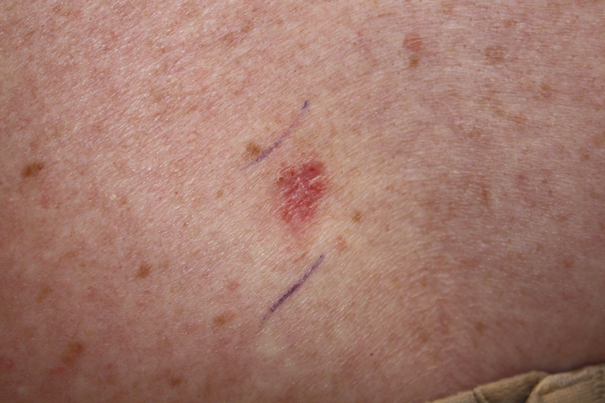
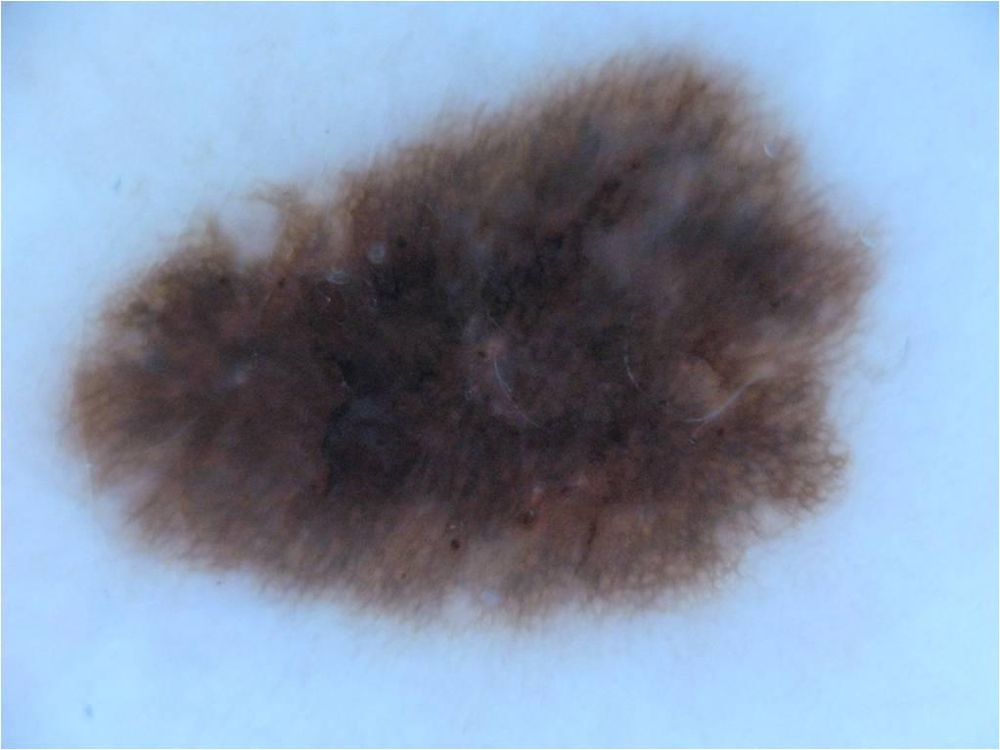
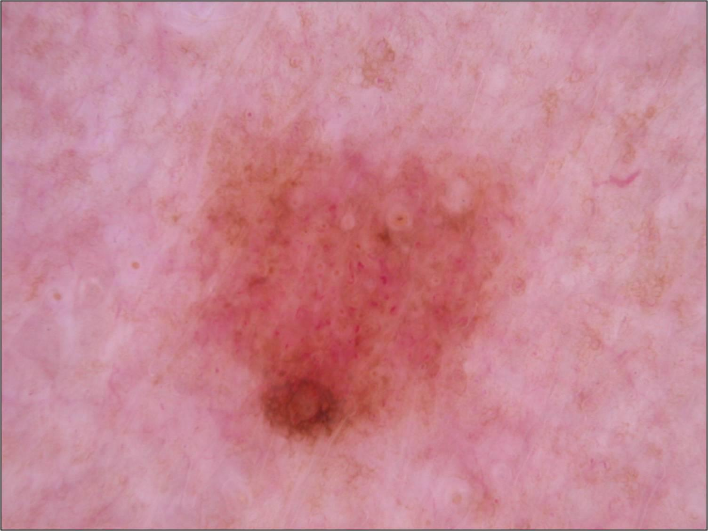
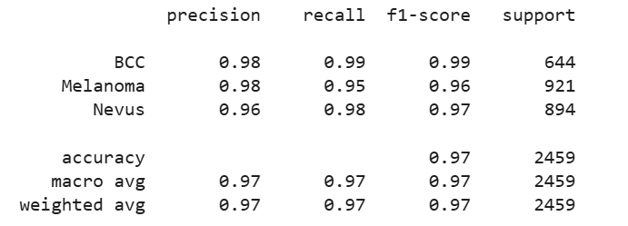
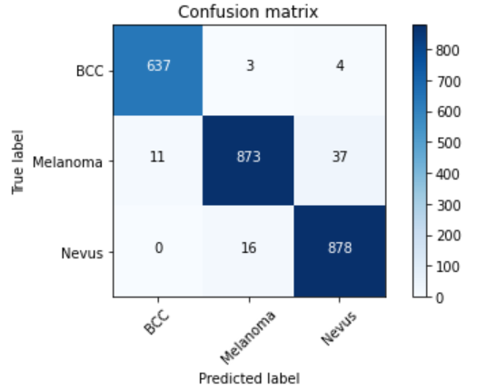
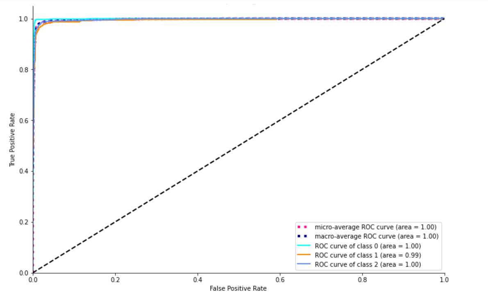
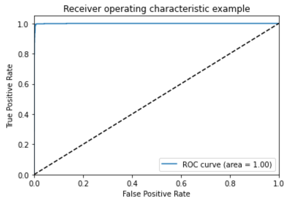
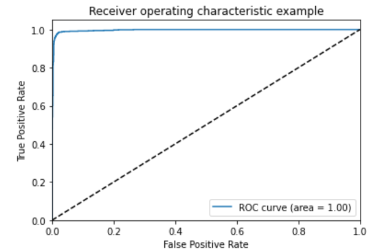

# Skin Cancer Diagnosis Using Transfer Learning

**A deep learning classifier that distinguishes Basal Cell Carcinoma, Melanoma, and Nevus from dermoscopic images, built on a fine-tuned MobileNetV2.**

---

## Table of Contents

- [Overview](#overview)
- [Highlights](#highlights)
- [Sample Images by Class](#sample-images-by-class)
- [Dataset](#dataset)
- [Results](#results)
  - [Classification Report](#classification-report)
  - [Confusion Matrix](#confusion-matrix)
  - [ROC Curves](#roc-curves)
- [Acknowledgments](#acknowledgments)

---

## Overview

| | |
|---|---|
| **Domain** | Computer Vision, Machine Learning |
| **Sub-Domain** | Deep Learning, Image Recognition |
| **Techniques** | Deep Convolutional Neural Network, Transfer Learning (MobileNetV2) |
| **Application** | Image Recognition, Image Classification, Medical Imaging |

---

## Highlights

- Classifies three types of skin lesions from dermoscopic images using transfer learning on MobileNetV2
- Customized architecture, fine-tuned specifically for this three-class problem
- Strong performance across all three classes — see [Results](#results) below
- Built on the [ISIC 2019 Challenge](https://challenge.isic-archive.com/data/) dataset

---

## Sample Images by Class

<table>
  <tr>
    <td align="center" width="33%">
       
      <b>Basal Cell Carcinoma</b>
    </td>
    <td align="center" width="33%">
       
      <b>Melanoma</b>
    </td>
    <td align="center" width="33%">
       
      <b>Nevus</b>
    </td>
  </tr>
</table>

---

## Dataset

**Source:** [ISIC Skin Cancer Challenge 2019](https://challenge.isic-archive.com/data/)

| | |
|---|---|
| **Dataset name** | ISIC Skin Cancer Images (Basal Cell Carcinoma vs Melanoma vs Nevus) |
| **Number of classes** | 3 |
| **Classes** | Basal Cell Carcinoma, Melanoma, Nevus |

---

## Results

### Classification Report

  

### Confusion Matrix

  

### ROC Curves

**Combined ROC (all classes with micro/macro average)**

  

**Per-Class Breakdown**

Labeled based on the alphabetical class ordering visible in the classification report and confusion matrix above (Keras's default when class names aren't explicitly passed). Verify against the training script's `CLASS_NAMES` order if these figures came from a different run.

<table>
  <tr>
    <td align="center" width="33%">
       
      <b>Basal Cell Carcinoma</b>
    </td>
    <td align="center" width="33%">
       
      <b>Melanoma</b>
    </td>
    <td align="center" width="33%">
       
      <b>Nevus</b>
    </td>
  </tr>
</table>

---

## Acknowledgments

Built on the [ISIC 2019 Challenge](https://challenge.isic-archive.com/data/) dataset, 
licensed under [CC-BY-NC 4.0](https://creativecommons.org/licenses/by-nc/4.0/).

Please cite the ISIC Archive and the underlying source datasets 
(HAM10000, BCN_20000, MSK) if you use this work or the dataset it is built on:

> Tschandl P., Rosendahl C. & Kittler H. The HAM10000 dataset, a large collection 
> of multi-source dermatoscopic images of common pigmented skin lesions. 
> Sci. Data 5, 180161 (2018).
>
> Codella N. et al. Skin Lesion Analysis Toward Melanoma Detection: A Challenge 
> at the 2017 ISBI, Hosted by ISIC. arXiv:1710.05006 (2017).
>
> Hernández-Pérez C. et al. BCN20000: Dermoscopic lesions in the wild. 
> Scientific Data 11, 641 (2024).

**Note:** This dataset is licensed for non-commercial use only. The trained model 
in this repository inherits that restriction.
